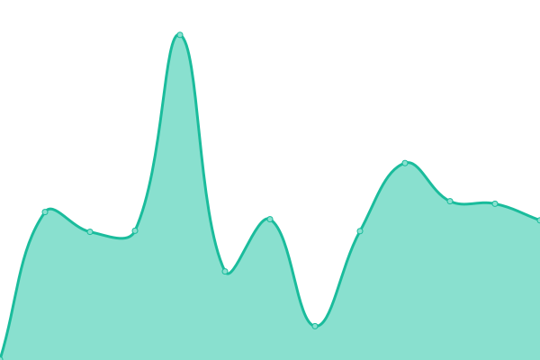

# [📈 Live Status](https://status.anthares101.com): <!--live status--> **🟩 All systems operational**

This repository contains the open-source uptime monitor and status page for [Ángel Heredia](https://anthares101.com/), powered by [Upptime](https://github.com/upptime/upptime).

With [Upptime](https://upptime.js.org), you can get your own unlimited and free uptime monitor and status page, powered entirely by a GitHub repository. We use [Issues](https://github.com/anthares101/status-page/issues) as incident reports, [Actions](https://github.com/anthares101/status-page/actions) as uptime monitors, and [Pages](https://status.anthares101.com) for the status page.

<!--start: status pages-->
<!-- This summary is generated by Upptime (https://github.com/upptime/upptime) -->
<!-- Do not edit this manually, your changes will be overwritten -->
<!-- prettier-ignore -->
| URL | Status | History | Response Time | Uptime |
| --- | ------ | ------- | ------------- | ------ |
|  [Anthares WriteUps](https://anthares101.com/) | 🟩 Up | [anthares-write-ups.yml](https://github.com/anthares101/status-page/commits/HEAD/history/anthares-write-ups.yml) | 

 139ms
     
 | 

<a href="https://status.anthares101.com/history/anthares-write-ups">100.00%</a>
    

|  [Raptor Blog](https://blog.anthares101.com/) | 🟩 Up | [raptor-blog.yml](https://github.com/anthares101/status-page/commits/HEAD/history/raptor-blog.yml) | 

 146ms
     
 | 

<a href="https://status.anthares101.com/history/raptor-blog">100.00%</a>
    

|  CTFNote | 🟩 Up | [ctf-note.yml](https://github.com/anthares101/status-page/commits/HEAD/history/ctf-note.yml) | 

 642ms
     
 | 

<a href="https://status.anthares101.com/history/ctf-note">99.41%</a>
    

|  Plex Server | 🟩 Up | [plex-server.yml](https://github.com/anthares101/status-page/commits/HEAD/history/plex-server.yml) | 

 988ms
     
 | 

<a href="https://status.anthares101.com/history/plex-server">99.27%</a>
    

|  Minecraft Server | 🟩 Up | [minecraft-server.yml](https://github.com/anthares101/status-page/commits/HEAD/history/minecraft-server.yml) | 

 142ms
     
 | 

<a href="https://status.anthares101.com/history/minecraft-server">99.72%</a>
    

<!--end: status pages-->

[**Visit our status website →**](https://status.anthares101.com)

## 📄 License

- Powered by: [Upptime](https://github.com/upptime/upptime)
- Code: [MIT](./LICENSE) © [Ángel Heredia](https://anthares101.com/)
- Data in the `./history` directory: [Open Database License](https://opendatacommons.org/licenses/odbl/1-0/)
